# Leveraged ETF Simulation and Analaysis
## Theoretical vs Actual Performance
- Author: Patrick Charles
- Date: 2015.06.28

## Summary

Leveraged ETF's are exchanged traded funds that use derivatives
and debt to magnify the returns of an underlying index. Such funds
apply a leverage multiplier (typical 2x or 3x) to amplify an index's
actual returns on a daily basis.

Because of the compounding effects of magnified daily returns and
price decay due to volatility, leveraged ETF managers typically do not
recommend holding such funds for long periods.

The following is an attempt to analyze and characterize the
long-term performance of leveraged ETFs compared to both simulated
ideal leveraged performance and the corresponding underlying non-leveraged
indicex.

## Environment

### Load the pre-requisite libraries

```r
  library(ggplot2)
  library(RColorBrewer)
  library(reshape2)
  library(quantmod)
  if(!require(PerformanceAnalytics))
    install.packages("PerformanceAnalytics", dep=T)
  library(PerformanceAnalytics)
```


## DJI Index

Several leveraged ETFs offer the ability to magnify the daily performance
of the Dow Jones Industrial Average. Here's a look at historical
DJI performance, since 2006-06-21. 


```r
  base.symbol <- "^DJI"
  startDate <- "2006-06-21"
  endDate <- Sys.Date()
  source <- "yahoo"

  ## load the dji actual/base (+1x)
  xts.base <- loadSeries(base.symbol, source, startDate, endDate)  

  ggplot(xts.base, aes(x=index(xts.base), y=DJI.Close)) + geom_line() +
          xlab("Date") + ylab("Price") + ggtitle("DJI Closing Price")
```

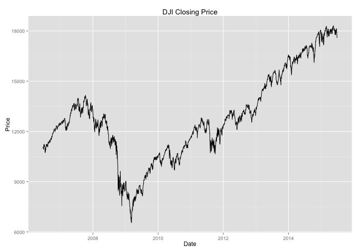 

## DJI Index vs. ProShares Leveraged Dow ETFs

2006.06.21 is the date that ProShares introduced leveraged ETF's to amplify
the daily performance of the DJI Index by -1x, -2x and +2x.

On 2010.02.11, ProShares introduced DOW ETF's with -3x and +3x leverage.

### Performance

The performance of the ETF's, since their inception, relative the underlying
index can be visualized using ggplot.

In addition, using simulation, we can see how perfectly efficient leverage
would have performed over the same period.


```r
  type <- "Close" # use closing prices, to mirror the actual ETF daily target
  base.name <- "DJI" 

  ## load the etf's and run comparable sims
  n1x <- loadAndSim(xts.base, source, "DOG", type, "n1x", -1.0)
  p2x <- loadAndSim(xts.base, source, "DDM", type, "p2x", 2.0)
  n2x <- loadAndSim(xts.base, source, "DXD", type, "n2x", -2.0)
  p3x <- loadAndSim(xts.base, source, "UDOW", type, "p3x", 3.0)
  n3x <- loadAndSim(xts.base, source, "SDOW", type, "n3x", -3.0)

  ## merge all the series into a single xts
  xts.merged <- merge(xts.base,
                      p2x$etf, p2x$sim,
                      p3x$etf, p3x$sim,
                      n1x$etf, n1x$sim,
                      n2x$etf, n2x$sim,
                      n3x$etf, n3x$sim) 
                    
  ## plot the results
  xtsMultiPlot(xts.merged, base.name, colors.pair, 
               "Leveraged ETF Performance: Actual and Simulated")
```

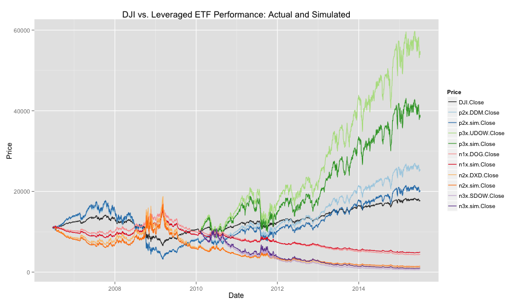 

### Observations: (DJI) 2x Leveraged ETF Relative Performance

Notice that the leveraged ETFs tend to outperform simulated ideal leverage
in periods of mostly steady increase or decrease.

Let's look more closely at the differences in yearly returns between the
2x leveraged ETF and the underlying index.

 

#### Calendar Year Return Comparison

```r
  return.monthly.col.index <- grep("Return.Monthly", names(p2x.merged))
  table.CalendarReturns(p2x.merged[,return.monthly.col.index])[, -(1:12)]
```

```
##      DJI.Return.Monthly DDM.Return.Monthly p2x.sim.Return.Monthly
## 2006               13.6               26.8                   26.0
## 2007                6.4                8.6                   10.9
## 2008              -33.8              -61.8                  -62.1
## 2009               18.8               39.7                   33.2
## 2010               11.0               25.4                   20.1
## 2011                5.5               10.4                    6.5
## 2012                7.3               17.7                   13.5
## 2013               26.5               64.7                   58.4
## 2014                7.5               18.0                   14.2
## 2015               -1.1               -1.5                   -3.1
```

#### Annualized Return


```r
  return.col.index <- grep("Return$", names(p2x.merged))
  returns.annual <- Return.annualized(p2x.merged[,return.col.index])
  round(returns.annual * 100, digits=2)
```

```
##                   DJI.Return DDM.Return p2x.sim.Return
## Annualized Return       5.39        9.6           6.93
```

#### Performance Comparison

```r
  charts.PerformanceSummary(p2x.merged[,return.col.index],
    colorset=colors.pair, lwd=2, ylog=TRUE)
```

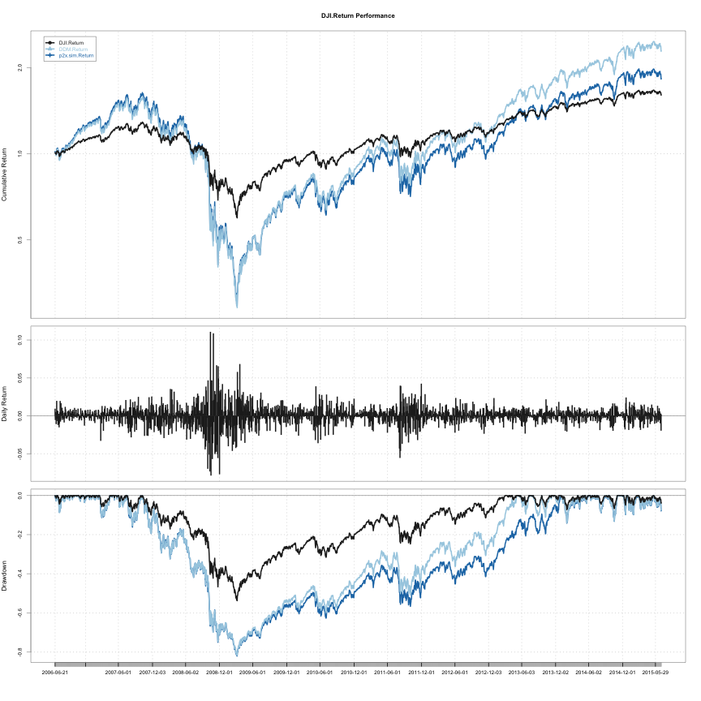 

#### Performance Statistics Comparison

```r
  table.Stats(p2x.merged[,return.col.index])
```

```
##                 DJI.Return DDM.Return p2x.sim.Return
## Observations     2272.0000  2272.0000      2272.0000
## NAs                 0.0000     0.0000         0.0000
## Minimum            -0.0787    -0.1597        -0.1575
## Quartile 1         -0.0043    -0.0084        -0.0085
## Median              0.0006     0.0014         0.0011
## Arithmetic Mean     0.0003     0.0006         0.0006
## Geometric Mean      0.0002     0.0004         0.0003
## Quartile 3          0.0055     0.0110         0.0110
## Maximum             0.1108     0.2259         0.2216
## SE Mean             0.0003     0.0005         0.0005
## LCL Mean (0.95)    -0.0002    -0.0003        -0.0004
## UCL Mean (0.95)     0.0008     0.0016         0.0016
## Variance            0.0002     0.0006         0.0006
## Stdev               0.0123     0.0237         0.0246
## Skewness            0.1487     0.0213         0.1487
## Kurtosis           10.8990     9.9545        10.8990
```

#### Trailing 36-Month Returns

```r
  p2x.box <- chart.Boxplot(p2x.merged[,return.monthly.col.index],
                           colorset=colors.pair)
```

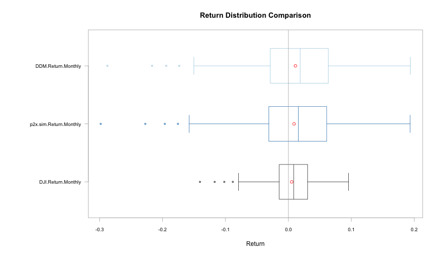 

#### Returns Histogram

```r
  ## convert to dataframe 
  df.merged <- as.data.frame(p2x.merged)
  ## create separate data column
  df.merged$Date <- as.Date(rownames(df.merged))
  ## melt by date
  df.melted <- melt(df.merged, id.vars=c("Date"))
  ## decompose all columns containing monthly returns into rows
  df.filtered <- df.melted[grep("Return.Monthly", df.melted$variable), ]
  ## eliminate dji by only selecting ETF and simulated leverage
  df.filtered <- df.filtered[grep("DDM|sim", df.filtered$variable), ]
  ggplot(df.filtered, aes(x=value*100, fill=variable)) +
    geom_histogram(alpha=0.3, position="identity") + 
    xlab("% Return") + ylab("Frequency") + ggtitle("Return Frequency") +
    scale_fill_manual("", values=colors.pair[2:3])
```

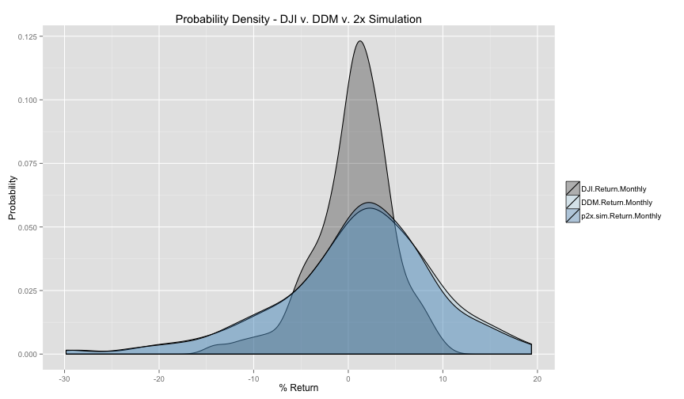 

#### Relative Risk vs. Return (Trailing 36-Month Returns)

The relative risk and return for the DJI, 2x ETF (DDD) and simulated 2x ETF
are shown. The risk/reward for a risk-free rate of return (~3%) is superimposed
over the plot.


```r
chart.RiskReturnScatter(p2x.merged[,return.monthly.col.index], Rf=0.03/12, add.boxplots=TRUE, colorset=colors.pair, xlim=c(0.0, 2.0), "Trailing 36-Month Performance")
```

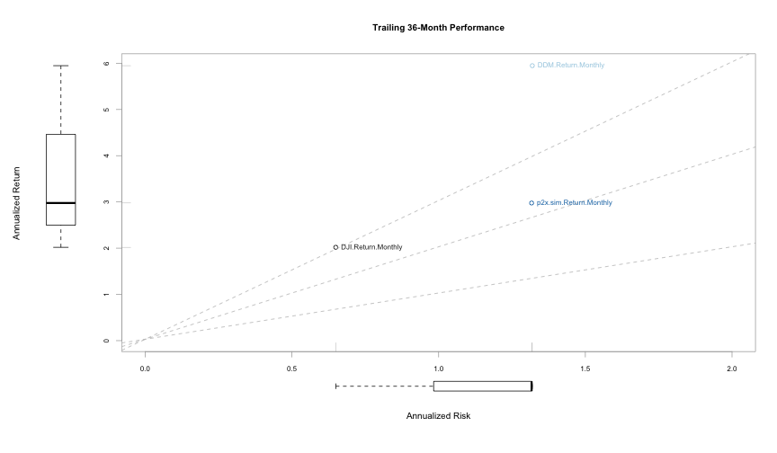 


## GDM Index

Let's look now at an index that hasn't seen the same virtually monotonic
increases in value during the recent bull run in the equity markets.

Several leveraged ETFs track the AMEX Gold Mining Index (GDM) which
seen significant volatility during 2014 and 2015. Here's a look
at the GDM performance since 2015-02-13.


```r
  base.symbol <- "GDM"
  startDate <- "2015-02-13"
  endDate <- Sys.Date()
  source <- "yahoo"

  ## load the gdm actual/base (+1x) 
  xts.base <- loadSeries(base.symbol, source, startDate, endDate)
  
  ggplot(xts.base, aes(x=index(xts.base), y=GDM.Close)) + geom_line() +
          xlab("Date") + ylab("Price") + ggtitle("GDM Closing Price")
```

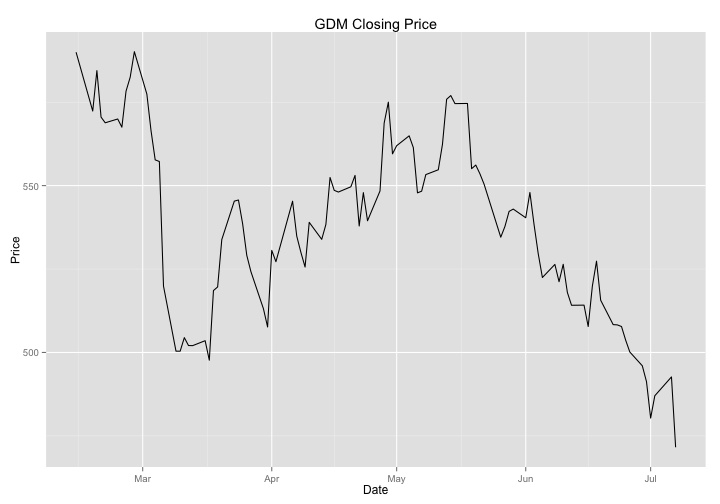 

## GDM Index vs. ProShares Leveraged ETFs

2015.02.13 is the date that ProShares introduced leveraged ETF's to amplify
the daily performance of the GDM Index by +/- 2x.

### Performance

The performance of the ETF's, since their inception, relative the underlying
index can be visualized using ggplot.

In addition, using simulation, we can see how perfectly efficient leverage
would have performed over the same period.


```r
  type <- "Close" # use closing prices, to mirror the actual ETF daily target
  base.name <- "GDM" 

  ## load the etf's and run comparable sims
  p2x <- loadAndSim(xts.base, source, "GDXX", type, "p2x", 3.0)
  n2x <- loadAndSim(xts.base, source, "GDXS", type, "n2x", -3.0)

  ## merge all the series into a single xts
  xts.merged <- merge(xts.base,
                      p2x$etf, p2x$sim,
                      n2x$etf, n2x$sim) 
                    
  ## plot the results 
  xtsMultiPlot(xts.merged, base.name, colors.pair, 
               "Leveraged ETF Performance: Actual and Simulated")
```

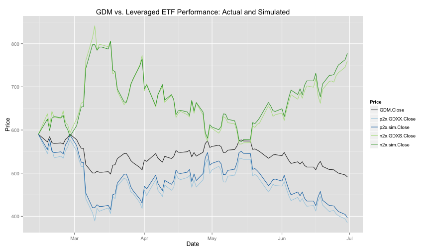 

### Observations: (GDM) -2x Leveraged ETF Relative Performance

Let's look more closely at the differences in yearly returns between the
-2x leveraged ETF and the underlying index. Here, the -2x leveraged fund is
chosen because the GDM index lost ground over the observation period.

Notice that in this case, where there has been volatility in the underlying
index, simulated leverage significantly outperformed the leveraged ETF.

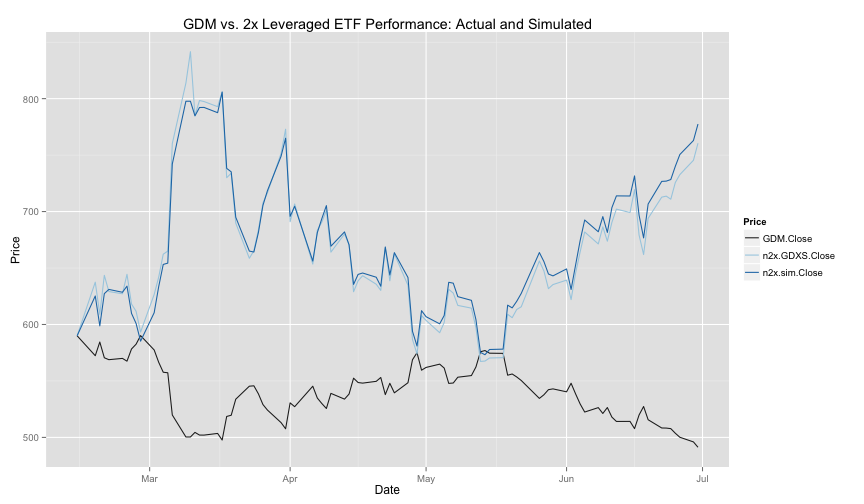 

#### Calendar Year Return Comparison

```r
  return.monthly.col.index <- grep("Return.Monthly", names(n2x.merged))
  table.CalendarReturns(n2x.merged[,return.monthly.col.index])[, -(1:12)]
```

```
##      GDM.Return.Monthly GDXS.Return.Monthly n2x.sim.Return.Monthly
## 2015              -16.3                  26                   44.7
```

#### Annualized Return


```r
  return.col.index <- grep("Return$", names(n2x.merged))
  returns.annual <- Return.annualized(n2x.merged[,return.col.index])
  round(returns.annual * 100, digits=2)
```

```
##                   GDM.Return GDXS.Return n2x.sim.Return
## Annualized Return     -37.71        85.9         156.69
```

#### Performance Comparison

```r
  charts.PerformanceSummary(n2x.merged[,return.col.index],
    colorset=colors.pair, lwd=2, ylog=TRUE)
```

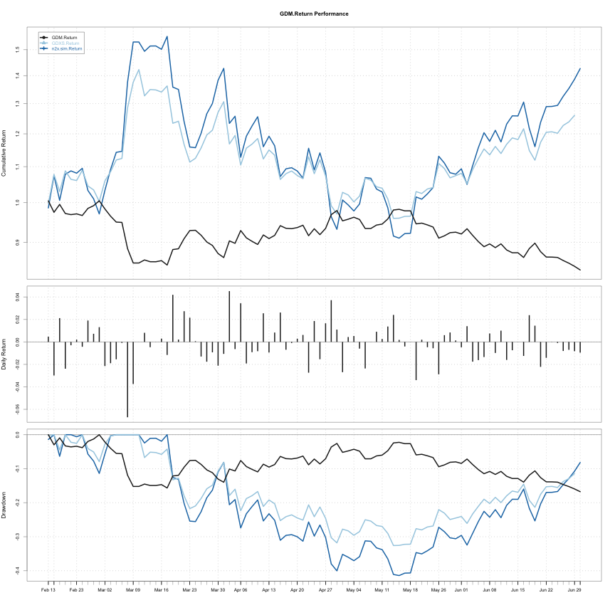 

#### Performance Statistics Comparison

```r
  table.Stats(n2x.merged[,return.col.index])
```

```
##                 GDM.Return GDXS.Return n2x.sim.Return
## Observations       95.0000     94.0000        95.0000
## NAs                 0.0000      1.0000         0.0000
## Minimum            -0.0671     -0.1060        -0.1357
## Quartile 1         -0.0120     -0.0179        -0.0234
## Median             -0.0009      0.0051         0.0028
## Arithmetic Mean    -0.0017      0.0033         0.0052
## Geometric Mean     -0.0019      0.0025         0.0037
## Quartile 3          0.0078      0.0269         0.0361
## Maximum             0.0452      0.1432         0.2012
## SE Mean             0.0018      0.0041         0.0055
## LCL Mean (0.95)    -0.0054     -0.0049        -0.0057
## UCL Mean (0.95)     0.0019      0.0114         0.0160
## Variance            0.0003      0.0016         0.0029
## Stdev               0.0178      0.0399         0.0535
## Skewness           -0.0999      0.0004         0.1019
## Kurtosis            1.3685      1.1255         1.3701
```

#### Trailing 36-Month Returns

```r
  n2x.box <- chart.Boxplot(n2x.merged[,return.monthly.col.index],
                           colorset=colors.pair)
```

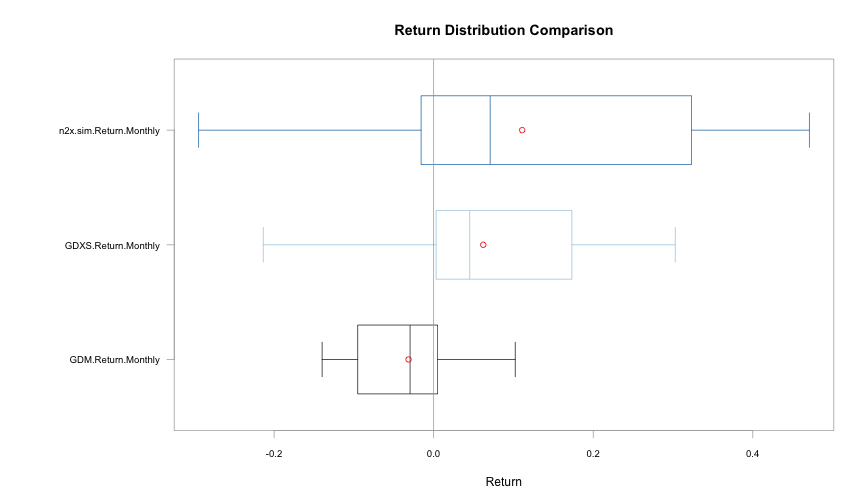 

#### Returns Histogram

```r
  ## convert to dataframe 
  df.merged <- as.data.frame(n2x.merged)
  ## create separate data column
  df.merged$Date <- as.Date(rownames(df.merged))
  ## melt by date
  df.melted <- melt(df.merged, id.vars=c("Date"))
  ## decompose all columns containing daily returns into rows
  df.filtered <- df.melted[grep("Return$", df.melted$variable), ]
  ## eliminate gdm by only selecting ETF and simulated leverage
  df.filtered <- df.filtered[grep("GDXS|sim", df.filtered$variable), ]
  ggplot(df.filtered, aes(x=value*100, fill=variable)) +
    geom_histogram(alpha=0.3, position="identity") + 
    xlab("% Return") + ylab("Frequency") + ggtitle("Return Frequency") +
    scale_fill_manual("", values=colors.pair[2:3])
```

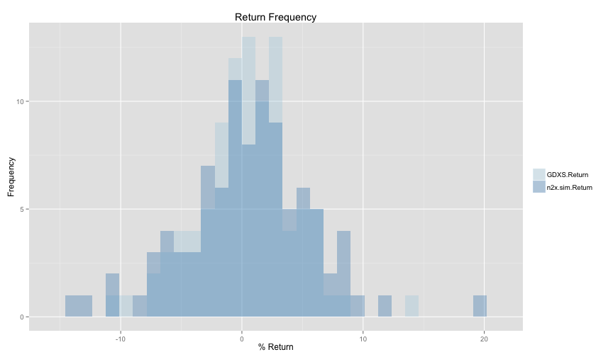 

#### Relative Risk vs. Return (Trailing 36-Month Returns)

The relative risk and return for the GDM, 2x ETF (DDD) and simulated 2x ETF
are shown. The risk/reward for a risk-free rate of return (~3%) is superimposed
over the plot.


```r
chart.RiskReturnScatter(n2x.merged[,return.col.index], Rf=0.03/12, add.boxplots=TRUE, colorset=colors.pair, xlim=c(0.0, 2.0), "Trailing 36-Month Performance")
```

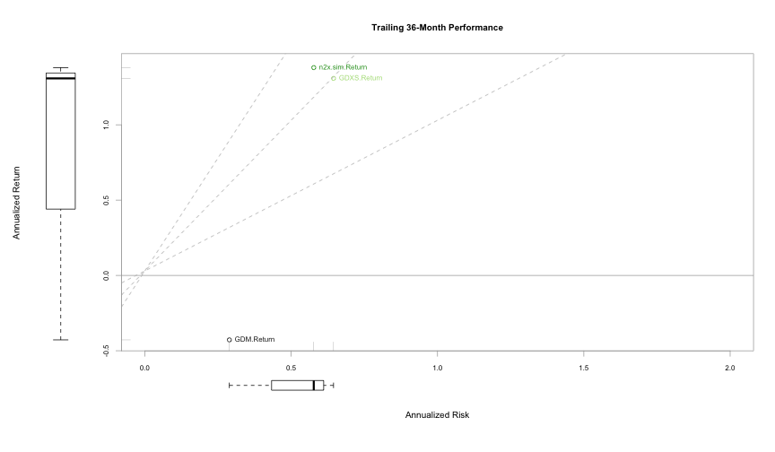 


