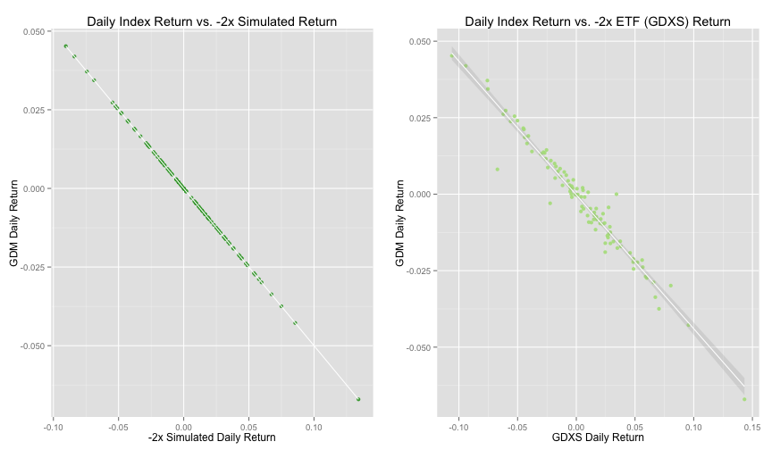
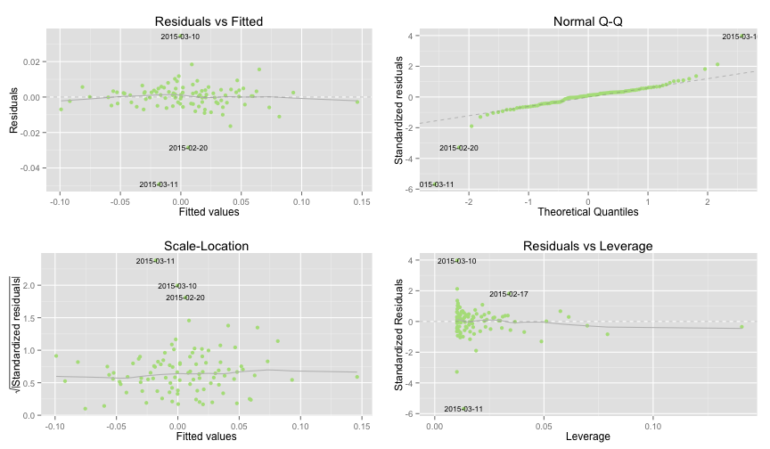

# Leveraged ETF Simulation and Analaysis
## Theoretical vs Actual Performance
- Author: Patrick Charles
- Date: 2015.06.28

### Summary

Leveraged ETF's are exchanged traded funds that use derivatives
and debt to magnify the returns of an underlying index. Such funds
apply a leverage multiplier (typical 2x or 3x) to amplify an index's
actual returns on a daily basis.

Because of the compounding effects of magnified daily returns and
price decay due to volatility, leveraged ETF managers typically do not
recommend holding such funds for long periods.

The following is an attempt to analyze and characterize the
long-term performance of leveraged ETFs compared to both simulated
ideal leveraged performance and the corresponding underlying non-leveraged
indexes.

All analysis below is performed in R and the code to transform and
manipulate the data shown for reproducibility.

### Environment

#### Load the pre-requisite libraries

```r
  library(ggplot2)
  library(gridExtra)
  library(RColorBrewer)
  library(reshape2)
  library(quantmod)
  if(!require(PerformanceAnalytics))
    install.packages("PerformanceAnalytics", dep=T)
  library(PerformanceAnalytics)
  library(devtools)
  if(!require(ggfortify))
    install_github('sinhrks/ggfortify')
  library(ggfortify)
```


## DJI Index

Several leveraged ETFs offer the ability to magnify the daily performance
of the Dow Jones Industrial Average. Here's a look at historical
DJI performance, since 2006-06-21. 


```r
  base.symbol <- "^DJI"
  startDate <- "2006-06-21"
  endDate <- Sys.Date()
  source <- "yahoo"

  ## load the dji actual/base (+1x)
  xts.base <- loadSeries(base.symbol, source, startDate, endDate)  

  ggplot(xts.base, aes(x=index(xts.base), y=DJI.Close)) + geom_line() +
          xlab("Date") + ylab("Price") + ggtitle("DJI Closing Price")
```

 

## DJI Index vs. ProShares Leveraged Dow ETFs

2006.06.21 is the date that ProShares introduced leveraged ETF's to amplify
the daily performance of the DJI Index by -1x, -2x and +2x.

On 2010.02.11, ProShares introduced DOW ETF's with -3x and +3x leverage.

### Performance

The performance of the ETF's, since their inception, relative the underlying
index can be visualized using ggplot.

In addition, using simulation, we can see how perfectly efficient leverage
would have performed over the same period.


```r
  type <- "Close" # use closing prices, to mirror the actual ETF daily target
  base.name <- "DJI" 

  ## load the etf's and run comparable sims
  n1x <- loadAndSim(xts.base, source, "DOG", type, "n1x", -1.0)
  p2x <- loadAndSim(xts.base, source, "DDM", type, "p2x", 2.0)
  n2x <- loadAndSim(xts.base, source, "DXD", type, "n2x", -2.0)
  p3x <- loadAndSim(xts.base, source, "UDOW", type, "p3x", 3.0)
  n3x <- loadAndSim(xts.base, source, "SDOW", type, "n3x", -3.0)

  ## merge all the series into a single xts
  xts.merged <- merge(xts.base,
                      p2x$etf, p2x$sim,
                      p3x$etf, p3x$sim,
                      n1x$etf, n1x$sim,
                      n2x$etf, n2x$sim,
                      n3x$etf, n3x$sim) 
                    
  ## plot the results
  xtsMultiPlot(xts.merged, base.name, colors.pair, 
               "Leveraged ETF Performance: Actual and Simulated")
```

 

### Observations: (DJI) 2x Leveraged ETF Relative Performance

Notice that the leveraged ETFs tend to outperform simulated ideal leverage
in periods of mostly steady increase or decrease.

 

Let's look more closely at the differences in returns between the
2x leveraged ETF and the underlying index over longer periods, where
the compounding effects cause divergences in performance between the ETF,
simulated ETF and underlying index.

#### Annual Return Comparison

```r
  return.mon.col.idx <- grep("Return.Monthly", names(p2x.merged))
  tc <- table.CalendarReturns(p2x.merged[,return.mon.col.idx])[, -(1:12)]
  tc$DDM_v_DJI <-
    round(tc$DDM.Return.Monthly / tc$DJI.Return.Monthly, digits=2)
  tc$DDM_v_SIM <-
    round(tc$DDM.Return.Monthly / tc$p2x.sim.Return.Monthly, digits=2)
  tc
```

```
##      DJI.Return.Monthly DDM.Return.Monthly p2x.sim.Return.Monthly
## 2006               13.6               26.8                   26.0
## 2007                6.4                8.6                   10.9
## 2008              -33.8              -61.8                  -62.1
## 2009               18.8               39.7                   33.2
## 2010               11.0               25.4                   20.1
## 2011                5.5               10.4                    6.5
## 2012                7.3               17.7                   13.5
## 2013               26.5               64.7                   58.4
## 2014                7.5               18.0                   14.2
## 2015               -1.1               -1.5                   -3.1
##      DDM_v_DJI DDM_v_SIM
## 2006      1.97      1.03
## 2007      1.34      0.79
## 2008      1.83      1.00
## 2009      2.11      1.20
## 2010      2.31      1.26
## 2011      1.89      1.60
## 2012      2.42      1.31
## 2013      2.44      1.11
## 2014      2.40      1.27
## 2015      1.36      0.48
```
All leveraged ETF prospectuses warn that performance for any period
longer than a day, returns can diverge significantly from the target
leverage multiplier. Nonetheless, on an annual basis,
DDM averaged **2.007x**!

Note, though, that this is due to coincidence, more than design, and the
existence of a bull market over the same period. During that same period,
there was very significant variation in the returns from year to year..

Compared to the DJI, but DDM had best and worst year multiples of
**2.44x** and **1.34x**, respectively.

#### Total Annualized Returns


```r
  return.col.index <- grep("Return$", names(p2x.merged))
  returns.annual <- Return.annualized(p2x.merged[,return.col.index])

  dji.return.annual <- returns.annual[1]
  ddm.return.annual <- returns.annual[2]
  p2x.return.annual <- returns.annual[3]

  round(returns.annual * 100, digits=2)
```

```
##                   DJI.Return DDM.Return p2x.sim.Return
## Annualized Return       5.39        9.6           6.93
```

On a yearly basis, at least since its inception, DDM has
nearly doubled
**(by 1.78x)**
the annual return of the underlying DJI index annual return 
**(5.39%)** and
has outperformed the 2x simulated ETF
**(by 1.39x)**.

#### Performance Comparison
 

The DDM ETF appears to have done better than the simulated ETF
in terms of risk. While the drawdown chart highlights the significant
potential downsides leveraged ETFs in general, it also shows less downside
exposure in DDM than the simulated 2x ETF.

#### Performance Statistics Comparison

```r
  table.Stats(p2x.merged[,return.col.index])
```

```
##                 DJI.Return DDM.Return p2x.sim.Return
## Observations     2272.0000  2272.0000      2272.0000
## NAs                 0.0000     0.0000         0.0000
## Minimum            -0.0787    -0.1597        -0.1575
## Quartile 1         -0.0043    -0.0084        -0.0085
## Median              0.0006     0.0014         0.0011
## Arithmetic Mean     0.0003     0.0006         0.0006
## Geometric Mean      0.0002     0.0004         0.0003
## Quartile 3          0.0055     0.0110         0.0110
## Maximum             0.1108     0.2259         0.2216
## SE Mean             0.0003     0.0005         0.0005
## LCL Mean (0.95)    -0.0002    -0.0003        -0.0004
## UCL Mean (0.95)     0.0008     0.0016         0.0016
## Variance            0.0002     0.0006         0.0006
## Stdev               0.0123     0.0237         0.0246
## Skewness            0.1487     0.0213         0.1487
## Kurtosis           10.8990     9.9545        10.8990
```

#### Trailing 36-Month Returns

```r
  p2x.box <- chart.Boxplot(p2x.merged[,return.mon.col.idx], colorset=colors.pair)
```

 

The DDM and simulated monthly return boxplot reiterates the slightly
better average performance of DDM vs. simulated ideal leverage. It shows
a similar range of returns for DDM and the simulation. Also note the
large range of return distributions and the very wide confidence interval
compared to the base index. Again, indicating the potential risks of
holding leveraged ETF for longer intervals (in this case, monthly return
intervals).


#### Probability Density (Monthly Returns)

Finally, lets look at the probability density function for the distribution
of monthly returns for the underlying index vs. leveraged ETF and simulation.


```r
  ## convert to dataframe 
  df.merged <- as.data.frame(p2x.merged)
  ## create separate data column
  df.merged$Date <- as.Date(rownames(df.merged))
  ## melt by date
  df.melted <- melt(df.merged, id.vars=c("Date"))
  ## decompose all columns containing monthly returns into rows
  df.filtered <- df.melted[grep("Return.Monthly", df.melted$variable), ]
  ## eliminate dji by only selecting ETF and simulated leverage
  ggplot(df.filtered, aes(x=value*100, fill=variable)) +
    geom_density(alpha=0.3, position="identity") + 
    xlab("% Return") + ylab("Probability") + ggtitle("Probability Density - DJI v. DDM v. 2x Simulation") +
    scale_fill_manual("", values=colors.pair)
```

 

This curve represents the likelihood of various levels of monthly returns
for DDM compared to the DJI and simulated ETF, based on all daily
returns since the inception of DDM. As expected, the functions are 'wider'
and 'shorter' (because of the application of leverage to magnify returns)
than the index and have more skew (because
of the compounding effects and its compounding effects).

Notice the very subtle difference between the shape of the DDM and
simulated leverage curves. 

#### Relative Risk vs. Return (Trailing 36-Month Returns)

The relative risk and return for the DJI, 2x ETF (DDD) and simulated 2x ETF
are shown. The risk/reward for a risk-free rate of return (~3%) is superimposed
over the plot.


```r
chart.RiskReturnScatter(p2x.merged[,return.mon.col.idx], Rf=0.03/12, add.boxplots=TRUE, colorset=colors.pair, xlim=c(0.0, 2.0), "Trailing 36-Month Performance")
```

 


## GDM Index

Let's look now at an index that hasn't seen the same virtually monotonic
increases in value during the recent bull run in the equity markets.

Several leveraged ETFs track the AMEX Gold Mining Index (GDM) which
has seen significant volatility during 2014 and 2015. Here's a look
at the GDM performance since the inception of corresponding leveraged
ETF's on 2015-02-13.


```r
  base.symbol <- "GDM"
  startDate <- "2015-02-13"
  endDate <- Sys.Date()
  source <- "yahoo"

  ## load the gdm actual/base (+1x) 
  xts.base <- loadSeries(base.symbol, source, startDate, endDate)
  
  ggplot(xts.base, aes(x=index(xts.base), y=GDM.Close)) + geom_line() +
          xlab("Date") + ylab("Price") + ggtitle("GDM Closing Price")
```

 

## GDM Index vs. ProShares Leveraged ETFs

2015.02.13 is the date that ProShares introduced leveraged ETF's to amplify
the daily performance of the GDM Index by +/- 2x.

### Performance

The performance of the ETF's, since their inception, relative the underlying
index can be visualized using ggplot.

In addition, using simulation, we can see how perfectly efficient leverage
would have performed over the same period.


```r
  type <- "Close" # use closing prices, to mirror the actual ETF daily target
  base.name <- "GDM" 

  ## load the etf's and run comparable sims
  p2x <- loadAndSim(xts.base, source, "GDXX", type, "p2x", 2.0)
  n2x <- loadAndSim(xts.base, source, "GDXS", type, "n2x", -2.0)

  ## merge all the series into a single xts
  xts.merged <- merge(xts.base,
                      p2x$etf, p2x$sim,
                      n2x$etf, n2x$sim) 
                    
  ## plot the results 
  xtsMultiPlot(xts.merged, base.name, colors.pair, 
               "Leveraged ETF Performance: Actual and Simulated")
```

 

### Observations: (GDM) -2x Leveraged ETF Relative Performance

Let's look more closely at the differences in yearly returns between the
-2x leveraged ETF and the underlying index. Here, the -2x leveraged fund is
chosen because the GDM index lost ground over the observation period.

 

Notice that in this case, where there has been volatility in the underlying
index, simulated leverage outperformed the leveraged ETF.

Again, let's look more closely at differences in returns between the -2x
leveraged ETF and the underlying index over longer periods, where the
compounding effects cause divergences in performance between the ETF,
simulated ETF and underlying index.

#### Annual Return Comparison

```r
  return.mon.col.idx <- grep("Return.Monthly", names(n2x.merged))
  tc <- table.CalendarReturns(n2x.merged[,return.mon.col.idx])[, -(1:12)]
  tc$GDXS_v_GDM <-
    round(tc$GDXS.Return.Monthly / tc$GDM.Return.Monthly, digits=2)
  tc$GDXS_v_SIM <-
    round(tc$GDXS.Return.Monthly / tc$n2x.sim.Return.Monthly, digits=2)
  tc    
```

```
##      GDM.Return.Monthly GDXS.Return.Monthly n2x.sim.Return.Monthly
## 2015              -16.3                28.6                   31.8
##      GDXS_v_GDM GDXS_v_SIM
## 2015      -1.75        0.9
```

On an annual basis, GDXS averaged **-1.75x** the return
of the base index.

At the same time, GDXS underperformed ideal simulated leverage,
with a return that was was **0.9x** that of ideal.


#### Performance Comparison
 
The GDXS ETF underperformed and was more risky than the ideal -2x simulated
ETF. This is evident in the drawdown chart which shows consistently larger
potential losses for the ETF vs. simulated returns.

#### Performance Statistics Comparison

```r
  table.Stats(n2x.merged[,return.col.index])
```

```
##                 GDM.Return GDXS.Return n2x.sim.Return
## Observations       95.0000     95.0000        95.0000
## NAs                 0.0000      0.0000         0.0000
## Minimum            -0.0671     -0.1060        -0.0905
## Quartile 1         -0.0120     -0.0177        -0.0156
## Median             -0.0009      0.0054         0.0019
## Arithmetic Mean    -0.0017      0.0034         0.0034
## Geometric Mean     -0.0019      0.0026         0.0028
## Quartile 3          0.0078      0.0267         0.0241
## Maximum             0.0452      0.1432         0.1341
## SE Mean             0.0018      0.0041         0.0037
## LCL Mean (0.95)    -0.0054     -0.0047        -0.0038
## UCL Mean (0.95)     0.0019      0.0115         0.0107
## Variance            0.0003      0.0016         0.0013
## Stdev               0.0178      0.0397         0.0357
## Skewness           -0.0991     -0.0124         0.0991
## Kurtosis            1.3628      1.1537         1.3628
```

#### Trailing 36-Month Returns

```r
  n2x.box <- chart.Boxplot(n2x.merged[,return.mon.col.idx],
                           colorset=colors.pair[c(1, 4:5)])
```

 
The simulated ETF shows a wider range of monthly with a higher
average result than the GDXS ETF.

#### Probability Density (Monthly Returns)

Finally, lets look at the probability density function for the distribution
of monthly returns for the underlying index vs. leveraged ETF and simulation.


```r
  ## convert to dataframe 
  df.merged <- as.data.frame(n2x.merged)
  ## create separate data column
  df.merged$Date <- as.Date(rownames(df.merged))
  ## melt by date
  df.melted <- melt(df.merged, id.vars=c("Date"))
  ## decompose all columns containing daily returns into rows
  df.filtered <- df.melted[grep("Return$", df.melted$variable), ]
  ## eliminate gdm by only selecting ETF and simulated leverage
  ggplot(df.filtered, aes(x=value*100, fill=variable)) +
    geom_density(alpha=0.3, position="identity") + 
    xlab("% Return") + ylab("Probability") + ggtitle("Probability Density - GDM vs. GDXS vs -2x Simulation") +
    scale_fill_manual("", values=colors.pair[c(1, 4:5)])
```

 

#### Relative Risk vs. Return (Trailing 36-Month Returns)

The relative risk and return for the GDM, 2x ETF (DDD) and simulated 2x ETF
are shown. The risk/reward for a risk-free rate of return (~3%) is superimposed
over the plot.


```r
chart.RiskReturnScatter(n2x.merged[,return.col.index], Rf=0.03/12, add.boxplots=TRUE, colorset=colors.pair[c(1, 4:5)], xlim=c(0.0, 2.0), "Trailing 36-Month Performance")
```

 


### Tracking Error

Now let's look at tracking error.

While leveraged ETF's are very good at magnifying the daily returns
of an underlying index, they aren't perfect.

Tracking error is the differences between the actual and expected
daily returns. Note that this is synonymous here with the
difference between the actual and simulated leveraged performance.

Tracking error can be visualized using a scatter plot of
daily returns of the index vs. ETF 

```r
  gdxs <- ggplot(xts.merged, aes(x=GDXS.Return, y=GDM.Return)) +
    geom_point(alpha=0.9, color=colors.pair[4]) +
    geom_smooth(method=lm, color="white", alpha=0.2) +
    ggtitle("Daily Index Return vs. -2x ETF (GDXS) Return") +
    xlab("GDXS Daily Return") + ylab("GDM Daily Return")

  n2x.sim <- ggplot(xts.merged, aes(x=n2x.sim.Return, y=GDM.Return)) +
    geom_point(alpha=0.9, color=colors.pair[5]) +
    geom_smooth(method=lm, color="white", alpha=0.2) +
    ggtitle("Daily Index Return vs. -2x Simulated Return") +
    xlab("-2x Simulated Daily Return") + ylab("GDM Daily Return")


  grid.arrange(n2x.sim, gdxs, ncol=2)
```

 

#### Linear Model

Linear models can be constructed from the actual daily returns of the ETFs
versus the corresponding underlying index.


```r
  gdxs.fit <- lm(data=xts.merged, GDXS.Return ~ GDM.Return)
  gdxs.fit
```

```
## 
## Call:
## lm(formula = GDXS.Return ~ GDM.Return, data = xts.merged)
## 
## Coefficients:
## (Intercept)   GDM.Return  
##  -0.0003024   -2.1716907
```
The slope of the GDXS model is -2.1716907,
indicating that the -2x ETF appears to be targeting/maintaining a
slightly higher than advertised level of leverage.


#### Residuals

Residuals (the difference between the expected and actual value)
of the daily returns can be visualized to determine if there is a
discernable pattern in the tracking error of the ETFs.


```r
  gdxs.resid <- resid(gdxs.fit)

  gdxs <- ggplot(xts.merged, aes(x=GDXS.Return, y=gdxs.resid)) + 
    geom_point(alpha=0.9, color=colors.pair[4]) +
    geom_smooth(method=lm) + 
    ggtitle("Residuals: GDXS vs. GDM") +
    xlab("GDXS Daily Return") +
    ylab("Variation from Expected")

#  grid.arrange(gdxx, gdxs, ncol=2)
```

#### Diagnostics

A set of diagnostics plots are used to identify outliers in the residuals
vs. fitted values.

We can use a set diagnostics to idetify outliers

```r
  autoplot(gdxs.fit, data=as.data.frame(xts.merged),
    colour=colors.pair[4], smooth.colour='gray', label.size=3)
```

 

While there don't appear to be any discernable patterns
in the residuals, scale-location trends or points exerting impactful
leverage, several dates appear to be associated with the largest
tracking errors.

* 2015-03-11 GDM: 13.56-14.58  7.52%    vs.  1.60% expected  (vol 11594)
* 2015-03-10 GDM: 14.22-13.56 -4.64%    vs.  0.00% expected  (vol  6301)
* 2015-02-20 GDM: 19.37-18.66 -3.67%    vs. -5.96% expected  (vol  6901)
* 2015-02-17 GDM: 20.56-19.00 -7.58%    vs. -5.98% expected  (vol  1000)

[NOTE: Causes here are not known. Looked at sector news, trading volumes
 and other factors; don't see any obvious reason for the discrepancies]
 
